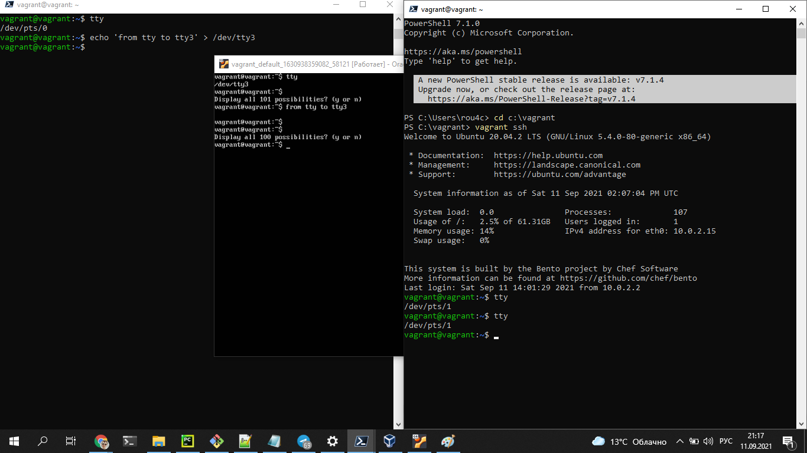

# Домашнее задание к занятию "3.2. Работа в терминале, лекция 2"

1. Какого типа команда `cd`? Попробуйте объяснить, почему она именно такого типа; опишите ход своих мыслей, если считаете что она могла бы быть другого типа.

```
type cd 
    >cd is a shell builtin
```

2. Какая альтернатива без pipe команде `grep <some_string> <some_file> | wc -l`? `man grep` поможет в ответе на этот вопрос. Ознакомьтесь с [документом](http://www.smallo.ruhr.de/award.html) о других подобных некорректных вариантах использования pipe.


```
*grep <some_string> <some_file> -с*
```

3. Какой процесс с PID `1` является родителем для всех процессов в вашей виртуальной машине Ubuntu 20.04?


```
systemd
```

4. Как будет выглядеть команда, которая перенаправит вывод stderr `ls` на другую сессию терминала?


```
*ls -l /root/ 2>/dev/pts/* 
```

5. Получится ли одновременно передать команде файл на stdin и вывести ее stdout в другой файл? Приведите работающий пример.


```
head -n 2 < test.txt >head.txt
```

6. Получится ли вывести находясь в графическом режиме данные из PTY в какой-либо из эмуляторов TTY? Сможете ли вы наблюдать выводимые данные?


```
 Да, получится.
```
<p align="center">
  
</p>


7. Выполните команду `bash 5>&1`. К чему она приведет? Что будет, если вы выполните `echo netology > /proc/$$/fd/5`? Почему так происходит?


```
Выполнение *bash 5>&1* команды приведет к созданию нового файлового дескриптора с id 5, перенаправлябщему информацию в нем на stdout. <br> При выполнении *echo netology > /proc/$$/fd/5* информация выведется в stdout
```

8. Получится ли в качестве входного потока для pipe использовать только stderr команды, не потеряв при этом отображение stdout на pty? Напоминаем: по умолчанию через pipe передается только stdout команды слева от `|` на stdin команды справа.
Это можно сделать, поменяв стандартные потоки местами через промежуточный новый дескриптор, который вы научились создавать в предыдущем вопросе.

```
cat testdir 5>&2 2>&1 1>&5 | grep directory
```

9. Что выведет команда `cat /proc/$$/environ`? Как еще можно получить аналогичный по содержанию вывод?

```
Команда *cat /proc/$$/environ* выводит переменные окружения. Аналог *env*
```

10. Используя `man`, опишите что доступно по адресам `/proc/<PID>/cmdline`, `/proc/<PID>/exe`.

```
/proc/[pid]/cmdline - Файл содержит комманду и аргументы <br>/proc/[pid]/exe служит для зжапуска копии процесса с <PID>
```

11. Узнайте, какую наиболее старшую версию набора инструкций SSE поддерживает ваш процессор с помощью `/proc/cpuinfo`.

```
sse4_2
```

12. При открытии нового окна терминала и `vagrant ssh` создается новая сессия и выделяется pty. Это можно подтвердить командой `tty`, которая упоминалась в лекции 3.2. Однако:

    ```bash
	vagrant@netology1:~$ ssh localhost 'tty'
	not a tty
    ```

	Почитайте, почему так происходит, и как изменить поведение.

    
```
 tty это эмулируемый аппаратно телетайп, а если мы пытаемся подключиться с использованием ssh, то эмуляция происходит программно. Измкениь поведение можно с ключа 'ssh -t'.
```

13. Бывает, что есть необходимость переместить запущенный процесс из одной сессии в другую. Попробуйте сделать это, воспользовавшись `reptyr`. Например, так можно перенести в `screen` процесс, который вы запустили по ошибке в обычной SSH-сессии.

```
pty: nano test.txt. tty: lsof |grep nano; reptyr \<PID>
```

14. `sudo echo string > /root/new_file` не даст выполнить перенаправление под обычным пользователем, так как перенаправлением занимается процесс shell'а, который запущен без `sudo` под вашим пользователем. Для решения данной проблемы можно использовать конструкцию `echo string | sudo tee /root/new_file`. Узнайте что делает команда `tee` и почему в отличие от `sudo echo` команда с `sudo tee` будет работать.


```
  tee записывает строку в файл и одновременно выводит ее в stdout. sudo echo запускается в терминале, работающем с провами обычного пользователя, sudo tee стартует как отдельный процесс с правами su. 
```
