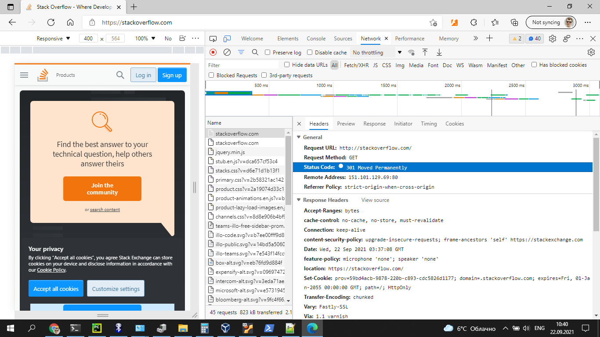
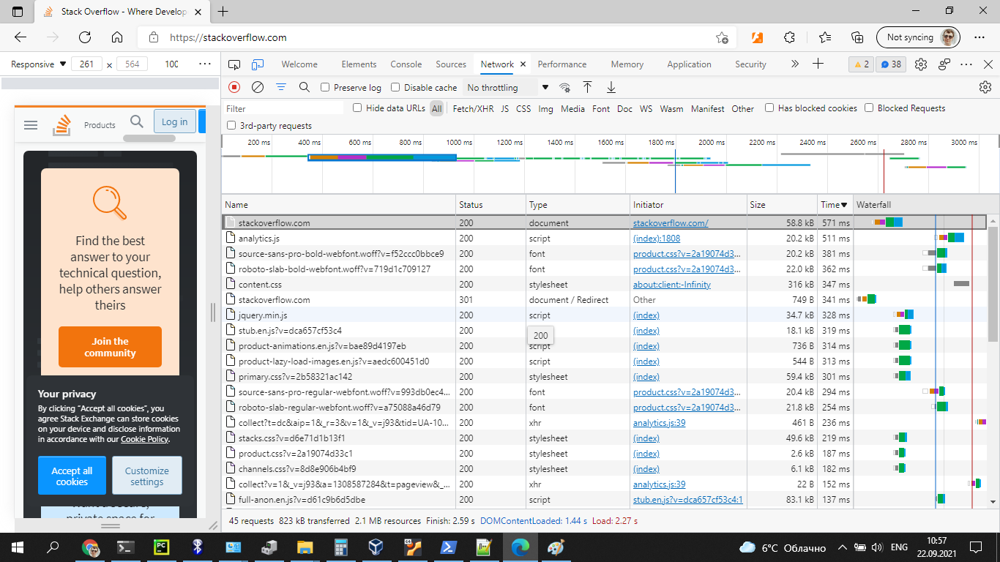
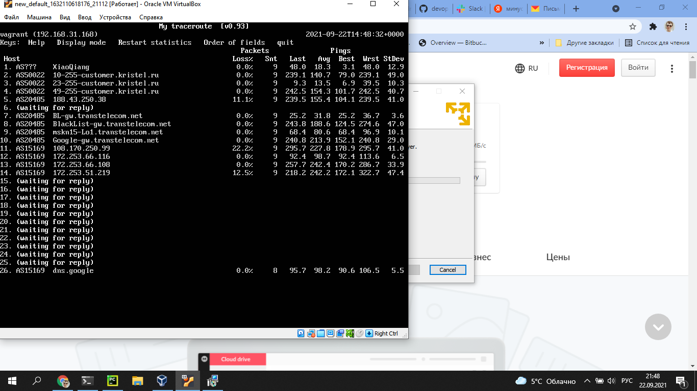

# Домашнее задание к занятию "3.6. Компьютерные сети, лекция 1"

1. Работа c HTTP через телнет.
- Подключитесь утилитой телнет к сайту stackoverflow.com
`telnet stackoverflow.com 80`
- отправьте HTTP запрос
```bash
GET /questions HTTP/1.0
HOST: stackoverflow.com
[press enter]
[press enter]
```
- В ответе укажите полученный HTTP код, что он означает?
## Ответ 1
```
vagrant@vagrant:~$ telnet stackoverflow.com 80
Trying 151.101.129.69...
Connected to stackoverflow.com.
Escape character is '^]'.
GET /questions HTTP/1.0
HOST: stackoverflow.com

HTTP/1.1 301 Moved Permanently
cache-control: no-cache, no-store, must-revalidate
location: https://stackoverflow.com/questions 
x-request-guid: 49f21ba0-04d4-4518-8cd3-2c471f43ae8d
feature-policy: microphone 'none'; speaker 'none'
content-security-policy: upgrade-insecure-requests; frame-ancestors 'self' https://stackexchange.com 
Accept-Ranges: bytes
Date: Wed, 22 Sep 2021 01:48:14 GMT
Via: 1.1 varnish
Connection: close
X-Served-By: cache-ams21066-AMS
X-Cache: MISS
X-Cache-Hits: 0
X-Timer: S1632275294.004483,VS0,VE75
Vary: Fastly-SSL
X-DNS-Prefetch-Control: off
Set-Cookie: prov=96504a9e-d824-d6c2-48ad-e5b54477e336; domain=.stackoverflow.com; expires=Fri, 01-Jan-2055 00:00:00 GMT; path=/; HttpOnly

Connection closed by foreign host.
```
301 - [Запрашиваемый ресурс перемещен навсегда](https://http.cat/301)

2. Повторите задание 1 в браузере, используя консоль разработчика F12.
- откройте вкладку `Network`
- отправьте запрос http://stackoverflow.com
- найдите первый ответ HTTP сервера, откройте вкладку `Headers`
- укажите в ответе полученный HTTP код.
- проверьте время загрузки страницы, какой запрос обрабатывался дольше всего?
- приложите скриншот консоли браузера в ответ.
### Ответ 2
<p align="center">
  
  
</p>

3. Какой IP адрес у вас в интернете?

## Ответ 3
IP 213.110.253.125<br>

4. Какому провайдеру принадлежит ваш IP адрес? Какой автономной системе AS? Воспользуйтесь утилитой `whois`
## Ответ 4
```
vagrant@vagrant:~$ whois 213.110.253.125 | grep origin
origin:         AS50022
vagrant@vagrant:~$ whois 213.110.253.125 | grep netname
netname:        RU-ORIONMNSK-20210212
```
5. Через какие сети проходит пакет, отправленный с вашего компьютера на адрес 8.8.8.8? Через какие AS? Воспользуйтесь утилитой `traceroute`
## Ответ 5
[traceroute 8.8.8.8](traceroute_8.8.8.8.md)<br>
6. Повторите задание 5 в утилите `mtr`. На каком участке наибольшая задержка - delay?
## Ответ 6

<p align="center">
  
</p>

7. Какие DNS сервера отвечают за доменное имя dns.google? Какие A записи? воспользуйтесь утилитой `dig`

## Ответ 7
Вывод dig +trace dns.google:
```
dns.google.             10800   IN      NS      ns3.zdns.google.
dns.google.             10800   IN      NS      ns2.zdns.google.
dns.google.             10800   IN      NS      ns1.zdns.google.
dns.google.             10800   IN      NS      ns4.zdns.google.
```

8. Проверьте PTR записи для IP адресов из задания 7. Какое доменное имя привязано к IP? воспользуйтесь утилитой `dig`
## Ответ 8
```
vagrant@vagrant:~$ dig -x 8.8.8.8
;; ANSWER SECTION:
8.8.8.8.in-addr.arpa.   300     IN      PTR     dns.google.
```
В качестве ответов на вопросы можно приложите лог выполнения команд в консоли или скриншот полученных результатов.