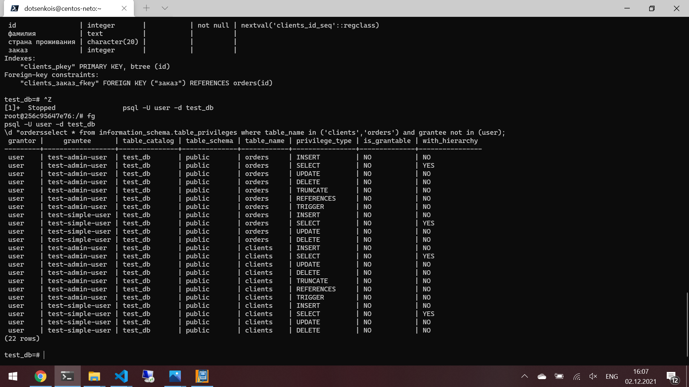

# Домашнее задание к занятию "6.2. SQL"

## Задача 1
docker-compose манифест

```YAML
version: '3.1'
services:
  db:
    image: postgres:12
    restart: always
    environment:
      POSTGRES_USER: user
      POSTGRES_PASSWORD: postgres
      POSTGRES_DB: neto_pgdb
      PGDATA: "/var/lib/postgresql/data/pgdata"
    volumes:
      - .PG/data:/var/lib/postgresql/data
      - .PG/bkp:/var/lib/postgresql
    ports:
      - "5432:5432"


```

## Задача 2

[файл запросов](02.sql) <br>

Приведите:

- итоговый список БД после выполнения пунктов выше
- описание таблиц (describe)
<p align="center">
  
</p>
- SQL-запрос для выдачи списка пользователей с правами над таблицами test_db

```sql
select * from information_schema.table_privileges where table_name in ('clients','orders') and grantee not in (user);
```

- список пользователей с правами над таблицами test_db
<p align="center">
  
</p>

## Задача 3

```sql
INSERT INTO orders (наименование, цена) VALUES ('Шоколад', 10);
INSERT INTO orders (наименование, цена) VALUES ('Принтер', 3000);
INSERT INTO orders (наименование, цена) VALUES ('Книга', 500);
INSERT INTO orders (наименование, цена) VALUES ('Монитор', 7000);
INSERT INTO orders (наименование, цена) VALUES ('Гитара', 4000);
INSERT INTO clients (фамилия, "страна проживания") VALUES ('Иванов Иван Иванович', 'USA');
INSERT INTO clients (фамилия, "страна проживания") VALUES ('Петров Петр Петрович', 'Canada');
INSERT INTO clients (фамилия, "страна проживания") VALUES ('Иоганн Себастьян Бах', 'Japan');
INSERT INTO clients (фамилия, "страна проживания") VALUES ('Ронни Джеймс Дио', 'Russia');
INSERT INTO clients (фамилия, "страна проживания") VALUES ('Ritchie Blackmore', 'Russia');

select count(*) from clients;
select count(*) from orders;
```

<p align="center">
  
</p>


## Задача 4

Приведите SQL-запросы для выполнения данных операций.
```sql
UPDATE clients SET заказ = 3 WHERE фамилия = 'Иванов Иван Иванович';
UPDATE clients SET заказ = 4 WHERE фамилия = 'Петров Петр Петрович';
UPDATE clients SET заказ = 5 WHERE фамилия = 'Иоганн Себастьян Бах';
```

Приведите SQL-запрос для выдачи всех пользователей, которые совершили заказ, а также вывод данного запроса.

```sql
select фамилия from clients WHERE заказ is not null;
```

<p align="center">
  
</p>

## Задача 5

Получите полную информацию по выполнению запроса выдачи всех пользователей из задачи 4 
(используя директиву EXPLAIN).

Приведите получившийся результат и объясните что значат полученные значения.

## Задача 6

Создайте бэкап БД test_db и поместите его в volume, предназначенный для бэкапов (см. Задачу 1).

Остановите контейнер с PostgreSQL (но не удаляйте volumes).

Поднимите новый пустой контейнер с PostgreSQL.

Восстановите БД test_db в новом контейнере.

Приведите список операций, который вы применяли для бэкапа данных и восстановления. 