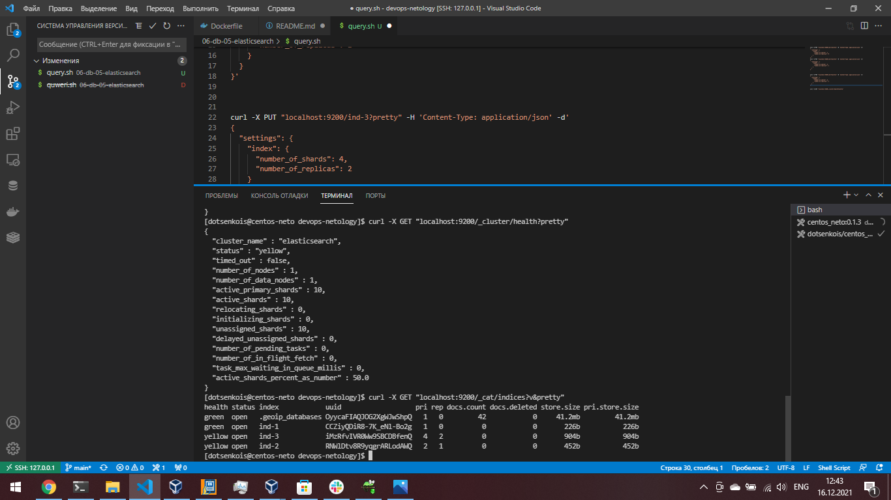

# Домашнее задание к занятию "6.5. Elasticsearch"

## Задача 1

- [текст Dockerfile манифеста](Dockerfile)
- [ссылку на образ в репозитории dockerhub](https://hub.docker.com/repository/docker/dotsenkois/centos_neto)
- [ответ `elasticsearch` на запрос пути `/` в json виде](01.JSON.png)

## Задача 2

Получите список индексов и их статусов, используя API и **приведите в ответе** на задание.

Получите состояние кластера `elasticsearch`, используя API.

  

Как вы думаете, почему часть индексов и кластер находится в состоянии yellow? 
***Часть индексов в состоянии "Желтый" по причине отсутствия реплик для них***

Удалите все индексы.

## Задача 3

В данном задании вы научитесь:
- создавать бэкапы данных
- восстанавливать индексы из бэкапов

Создайте директорию `{путь до корневой директории с elasticsearch в образе}/snapshots`.

Используя API [зарегистрируйте](https://www.elastic.co/guide/en/elasticsearch/reference/current/snapshots-register-repository.html#snapshots-register-repository) 
данную директорию как `snapshot repository` c именем `netology_backup`.

**Приведите в ответе** запрос API и результат вызова API для создания репозитория.

Создайте индекс `test` с 0 реплик и 1 шардом и **приведите в ответе** список индексов.

[Создайте `snapshot`](https://www.elastic.co/guide/en/elasticsearch/reference/current/snapshots-take-snapshot.html) 
состояния кластера `elasticsearch`.

**Приведите в ответе** список файлов в директории со `snapshot`ами.

Удалите индекс `test` и создайте индекс `test-2`. **Приведите в ответе** список индексов.

[Восстановите](https://www.elastic.co/guide/en/elasticsearch/reference/current/snapshots-restore-snapshot.html) состояние
кластера `elasticsearch` из `snapshot`, созданного ранее. 

**Приведите в ответе** запрос к API восстановления и итоговый список индексов.

Подсказки:
- возможно вам понадобится доработать `elasticsearch.yml` в части директивы `path.repo` и перезапустить `elasticsearch`