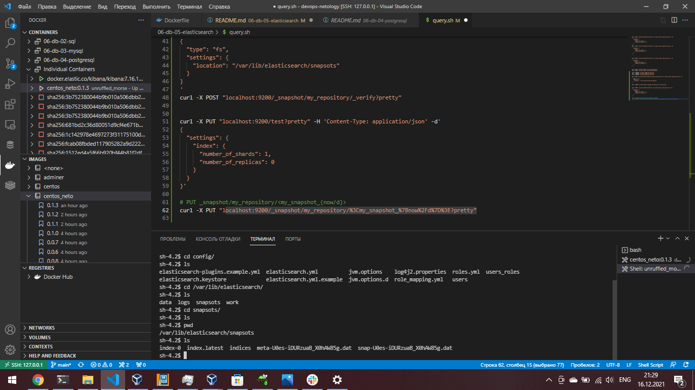

# Домашнее задание к занятию "6.5. Elasticsearch"

## Задача 1

- [текст Dockerfile манифеста](Dockerfile)
- [ссылку на образ в репозитории dockerhub](https://hub.docker.com/repository/docker/dotsenkois/centos_neto)
- [ответ `elasticsearch` на запрос пути `/` в json виде](01.JSON.png)

## Задача 2

Получите список индексов и их статусов, используя API и **приведите в ответе** на задание.

Получите состояние кластера `elasticsearch`, используя API.

<p align="center">
  
</p>

Как вы думаете, почему часть индексов и кластер находится в состоянии yellow?<br>
***Часть индексов в состоянии "Желтый" по причине отсутствия реплик для них***

Удалите все индексы.

## Задача 3

В данном задании вы научитесь:
- создавать бэкапы данных
- восстанавливать индексы из бэкапов

Создайте директорию `{путь до корневой директории с elasticsearch в образе}/snapshots`.

Используя API [зарегистрируйте](https://www.elastic.co/guide/en/elasticsearch/reference/current/snapshots-register-repository.html#snapshots-register-repository) 
данную директорию как `snapshot repository` c именем `netology_backup`.

**Приведите в ответе** запрос API и результат вызова API для создания репозитория.
```sh
[dotsenkois@centos-neto devops-netology]$ curl -X PUT "localhost:9200/_snapshot/my_repository?pretty" -H 'Content-Type: application/json' -d'
> {
>   "type": "fs",
>   "settings": {
>     "location": "/var/lib/elasticsearch/snapsots"
>   }
> }
> '
{
  "acknowledged" : true
}
[dotsenkois@centos-neto devops-netology]$ curl -X POST "localhost:9200/_snapshot/my_repository/_verify?pretty"
{
  "nodes" : {
    "KIETUtCRQGSkVvlQ1E08XQ" : {
      "name" : "netology_test"
    }
  }

```


Создайте индекс `test` с 0 реплик и 1 шардом и **приведите в ответе** список индексов.
```
[dotsenkois@centos-neto devops-netology]$ curl -X PUT "localhost:9200/test?pretty" -H 'Content-Type: application/json' -d'
   "index": {
      "number_of_shards": 1,  
     > {
>   "settings": {
>     "index": {
>       "number_of_shards": 1,  
>       "number_of_replicas": 0 
>     }
>   }
> }'
{
  "acknowledged" : true,
  "shards_acknowledged" : true,
  "index" : "test"
}
[dotsenkois@centos-neto devops-netology]$ curl -X GET "localhost:9200/_cat/indices?v&pretty"
health status index            uuid                   pri rep docs.count docs.deleted store.size pri.store.size
green  open   .geoip_databases OyycaFIAQJOG2XgWJwShpQ   1   0         42            0     41.2mb         41.2mb
green  open   test             nAZhlD1ETPO_0jGp4dm-ug   1   0          0            0       226b           226b
```


[Создайте `snapshot`](https://www.elastic.co/guide/en/elasticsearch/reference/current/snapshots-take-snapshot.html) 
состояния кластера `elasticsearch`.

**Приведите в ответе** список файлов в директории со `snapshot`ами.

<p align="center">
  
</p>

Удалите индекс `test` и создайте индекс `test-2`. **Приведите в ответе** список индексов.
```
[dotsenkois@centos-neto devops-netology]$ curl -X DELETE "localhost:9200/test?pretty"
{
  "acknowledged" : true
}
[dotsenkois@centos-neto devops-netology]$ curl -X GET "localhost:9200/_cat/indices?v&pretty"
health status index            uuid                   pri rep docs.count docs.deleted store.size pri.store.size
green  open   .geoip_databases OyycaFIAQJOG2XgWJwShpQ   1   0         42            0     41.2mb         41.2mb
green  open   test-2           _y7X70EETwavZyU_d-Cwsw   1   0          0            0       226b           226b
[dotsenkois@centos-neto devops-netology]$ 

```


[Восстановите](https://www.elastic.co/guide/en/elasticsearch/reference/current/snapshots-restore-snapshot.html) состояние
кластера `elasticsearch` из `snapshot`, созданного ранее. 

**Приведите в ответе** запрос к API восстановления и итоговый список индексов.

<p align="center">
  
</p>