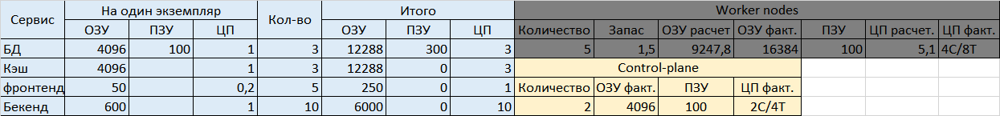

# Домашнее задание к занятию "12.3 Развертывание кластера на собственных серверах, лекция 1"

## Ответ на задание

Исходя из требования отказоустойчивости предоположу, что каждый из экземпляров БД и кэша должен находиться на своей ноде, поэтому количество рабочих нод - не менее трех. Так же одну рабочую ноду я бы поставил на "горячий" резерв, а еще одну на "холодный", однако при условии необходимости нечетного количества нод и запаса под масштабирование окончательное количество рабочих нод - 5.

Исходя из того, что на каждой из 5-х нод будет крутиться по 1 экз. БД и кэша, 1 экз. фронтенда и 2 экз. бэкенда, а так же полуторакратный запас, и то, что в задании не указаны требования к ПЗУ, параметры каждой ноды должны быть следующими:

  

## Задание

Поработав с персональным кластером, можно заняться проектами. Вам пришла задача подготовить кластер под новый проект.

## Задание 1: Описать требования к кластеру
Сначала проекту необходимо определить требуемые ресурсы. Известно, что проекту нужны база данных, система кеширования, а само приложение состоит из бекенда и фронтенда. Опишите, какие ресурсы нужны, если известно:

* База данных должна быть отказоустойчивой. Потребляет 4 ГБ ОЗУ в работе, 1 ядро. 3 копии.
* Кэш должен быть отказоустойчивый. Потребляет 4 ГБ ОЗУ в работе, 1 ядро. 3 копии.
* Фронтенд обрабатывает внешние запросы быстро, отдавая статику. Потребляет не более 50 МБ ОЗУ на каждый экземпляр, 0.2 ядра. 5 копий.
* Бекенд потребляет 600 МБ ОЗУ и по 1 ядру на копию. 10 копий.

## Как оформить ДЗ?

Выполненное домашнее задание пришлите ссылкой на .md-файл в вашем репозитории.

План расчета
1. Сначала сделайте расчет всех необходимых ресурсов.
2. Затем прикиньте количество рабочих нод, которые справятся с такой нагрузкой.
3. Добавьте к полученным цифрам запас, который учитывает выход из строя как минимум одной ноды.
4. Добавьте служебные ресурсы к нодам. Помните, что для разных типов нод требовния к ресурсам разные.
5. Рассчитайте итоговые цифры.
6. В результате должно быть указано количество нод и их параметры.
