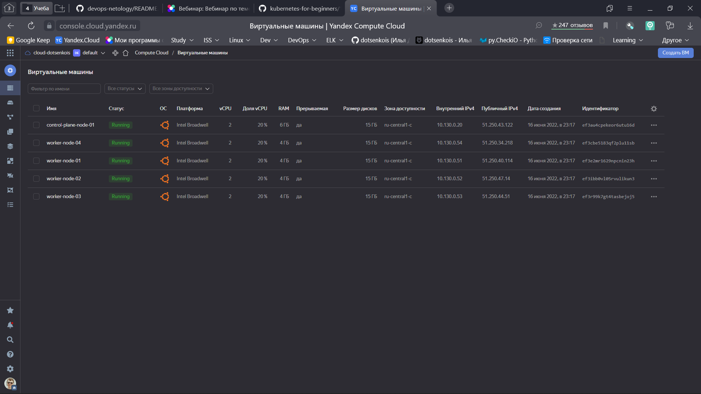
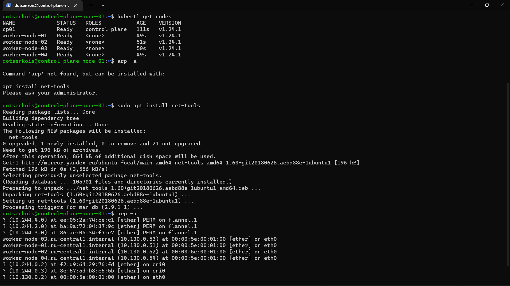

# Домашнее задание к занятию "12.4 Развертывание кластера на собственных серверах, лекция 2"
## Ответ на домашнее задение.

## 1.
```yml
---
all:
  hosts:
    control-plane-node-01:
      ansible_host: 51.250.37.43
    worker-node-01:
      ansible_host: 51.250.38.101
    worker-node-02:
      ansible_host: 51.250.37.148
    worker-node-03:
      ansible_host: 51.250.35.104
    worker-node-04:
      ansible_host: 51.250.47.188

k8s_cluster:
  children:
    kube_control_plane:
      hosts:
        control-plane-node-01:
    kube_node:
      hosts:
        worker-node-01:
        worker-node-02:
        worker-node-03:
        worker-node-04:
    etcd:
      hosts:
        control-plane-node-01:
    calico_rr:
      hosts:

  vars:
    ansible_connection_type: paramiko
    ansible_user: dotsenkois

```
```console
PLAY RECAP *****************************************************************************************************************************************
control-plane-node-01      : ok=748  changed=143  unreachable=0    failed=0    skipped=1229 rescued=0    ignored=9   
localhost                  : ok=3    changed=0    unreachable=0    failed=0    skipped=0    rescued=0    ignored=0   
worker-node-01             : ok=497  changed=93   unreachable=0    failed=0    skipped=722  rescued=0    ignored=2   
worker-node-02             : ok=497  changed=93   unreachable=0    failed=0    skipped=721  rescued=0    ignored=2   
worker-node-03             : ok=497  changed=93   unreachable=0    failed=0    skipped=721  rescued=0    ignored=2   
worker-node-04             : ok=497  changed=93   unreachable=0    failed=0    skipped=721  rescued=0    ignored=2   

Tuesday 21 June 2022  23:50:05 -0400 (0:00:00.116)       0:29:28.388 ********** 
```

## 2. Инвентарь для облака. (на примере YC)

В файле [variables.tf](./tf/terraform/variables.tf) перечислены инстансы и их параметры
```t
variable "yc_instances_control-plane" {
  type = map(any)
  default = {
    "control-plane-node-01" = "10.130.0.20"
  }
}

variable "yc_instances_workers" {
  type = map(any)
  default = {
    "worker-node-01" = "10.130.0.51"
    "worker-node-02" = "10.130.0.52"
    "worker-node-03" = "10.130.0.53"
    "worker-node-04" = "10.130.0.54"

  }
}

variable "control-plane_resources" {
  type = map(any)
  default = {
    "core_fraction"  = 20
    "cores"          = 2
    "memory"         = 6
    "boot_disk_size" = 15
  }
}

variable "workers_resources" {
  type = map(any)
  default = {
    "core_fraction"  = 20
    "cores"          = 2
    "memory"         = 4
    "boot_disk_size" = 15
  }
}
```
- с помощью [inventory.tf](./tf/terraform/inventory.tf)
создается инвентарь следующего вида:

```yml
---
all:
  hosts:
    control-plane-node-01:
      ansible_host: 51.250.43.122
    worker-node-01:
      ansible_host: 51.250.40.114
    worker-node-02:
      ansible_host: 51.250.47.14
    worker-node-03:
      ansible_host: 51.250.44.51
    worker-node-04:
      ansible_host: 51.250.34.218

  children:
    control-plane:
      hosts:
        control-plane-node-01:
    workers:
      hosts:
        worker-node-01:
        worker-node-02:
        worker-node-03:
        worker-node-04:

  vars:
    ansible_connection_type: paramiko
    ansible_user: dotsenkois

```
- В резульате всех задач [плейбука](./tf/playbook/site.yml) получается такой кластер: 

<p align="center">
  
</p>

<p align="center">
  
</p>


Новые проекты пошли стабильным потоком. Каждый проект требует себе несколько кластеров: под тесты и продуктив. Делать все руками — не вариант, поэтому стоит автоматизировать подготовку новых кластеров.

## Задание 1: Подготовить инвентарь kubespray
Новые тестовые кластеры требуют типичных простых настроек. Нужно подготовить инвентарь и проверить его работу. Требования к инвентарю:
* подготовка работы кластера из 5 нод: 1 мастер и 4 рабочие ноды;
* в качестве CRI — containerd;
* запуск etcd производить на мастере.

## Задание 2 (*): подготовить и проверить инвентарь для кластера в AWS
Часть новых проектов хотят запускать на мощностях AWS. Требования похожи:
* разворачивать 5 нод: 1 мастер и 4 рабочие ноды;
* работать должны на минимально допустимых EC2 — t3.small.

---

### Как оформить ДЗ?

Выполненное домашнее задание пришлите ссылкой на .md-файл в вашем репозитории.

---
