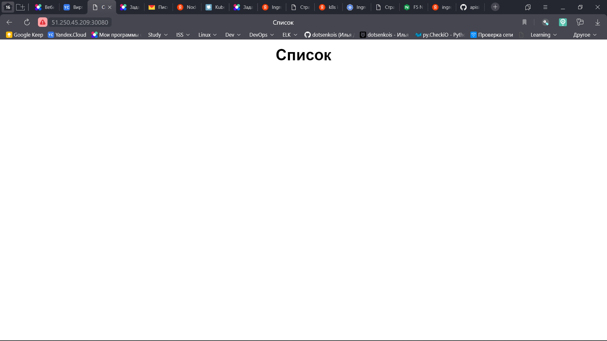

# Домашнее задание к занятию "13.1 контейнеры, поды, deployment, statefulset, services, endpoints"

## Решение

порядок выполнения операций описан в файле [runme.sh](./manifests/runme.sh)

созданы [2 namespaces](manifests/namespaces.yml)

```console
cat 13-1.sh
kubectl get po
kubectl get svc
kubectl get deployments.apps
kubectl get statefulsets.apps
kubectl describe service frontend
```

1. stage:
   - [deployment](./manifests/stage/deployment.yml)
   - [statefulset](./manifests/stage/statefulset.yml)
```console
root@control-plane-node-01:~# ./13-1.sh
NAME                                READY   STATUS    RESTARTS   AGE
db-0                                1/1     Running   0          76m
frontend-backend-85485c4cb9-g7fph   2/2     Running   0          89m
NAME               TYPE        CLUSTER-IP      EXTERNAL-IP   PORT(S)             AGE
db                 ClusterIP   10.233.11.185   <none>        5432/TCP            89m
frontend-backend   ClusterIP   10.233.11.184   <none>        8000/TCP,9000/TCP   89m
NAME               READY   UP-TO-DATE   AVAILABLE   AGE
frontend-backend   1/1     1            1           89m
NAME   READY   AGE
db     1/1     89m
Name:              frontend-backend
Namespace:         stage
Labels:            <none>
Annotations:       <none>
Selector:          app=frontend
Type:              ClusterIP
IP Family Policy:  SingleStack
IP Families:       IPv4
IP:                10.233.11.184
IPs:               10.233.11.184
Port:              frontend  8000/TCP
TargetPort:        80/TCP
Endpoints:         <none>
Port:              backend  9000/TCP
TargetPort:        9000/TCP
Endpoints:         <none>
Session Affinity:  None
Events:            <none>
```
2. prod:
   - [deployment](./manifests/prod/deployment.yml)
   - [statefulset](./manifests/prod/statefulset.yml)
```console
root@control-plane-node-01:~# ./13-1.sh
NAME                      READY   STATUS    RESTARTS   AGE
backend-db8cf8d59-fjt2l   1/1     Running   0          71m
db-0                      1/1     Running   0          71m
frontend-c6dbbc9c-srcdw   1/1     Running   0          71m
NAME       TYPE        CLUSTER-IP     EXTERNAL-IP   PORT(S)        AGE
backend    ClusterIP   10.233.46.7    <none>        9000/TCP       71m
db         ClusterIP   10.233.14.9    <none>        5432/TCP       71m
frontend   NodePort    10.233.6.213   <none>        80:30080/TCP   71m
NAME       READY   UP-TO-DATE   AVAILABLE   AGE
backend    1/1     1            1           71m
frontend   1/1     1            1           71m
NAME   READY   AGE
db     1/1     71m

```

3. endpoint:
   - [endpoint](./manifests/prod/endpoint.yml)

```console
Name:                     frontend
Namespace:                prod
Labels:                   <none>
Annotations:              <none>
Selector:                 app=frontend
Type:                     NodePort
IP Family Policy:         SingleStack
IP Families:              IPv4
IP:                       10.233.6.213
IPs:                      10.233.6.213
Port:                     web  80/TCP
TargetPort:               80/TCP
NodePort:                 web  30080/TCP
Endpoints:                10.233.78.71:80
Session Affinity:         None
External Traffic Policy:  Cluster
Events:
  Type    Reason  Age   From                Message
  ----    ------  ----  ----                -------
  Normal  Type    33s   service-controller  LoadBalancer -> NodePort
```
## Скрин
фронтенд доступен из вне (Правда, не по тому порту, по которому хотелось бы)



## Задания
Настроив кластер, подготовьте приложение к запуску в нём. Приложение стандартное: бекенд, фронтенд, база данных. Его можно найти в папке 13-kubernetes-config.

## Задание 1: подготовить тестовый конфиг для запуска приложения
Для начала следует подготовить запуск приложения в stage окружении с простыми настройками. Требования:
* под содержит в себе 2 контейнера — фронтенд, бекенд;
* регулируется с помощью deployment фронтенд и бекенд;
* база данных — через statefulset.

## Задание 2: подготовить конфиг для production окружения
Следующим шагом будет запуск приложения в production окружении. Требования сложнее:
* каждый компонент (база, бекенд, фронтенд) запускаются в своем поде, регулируются отдельными deployment’ами;
* для связи используются service (у каждого компонента свой);
* в окружении фронта прописан адрес сервиса бекенда;
* в окружении бекенда прописан адрес сервиса базы данных.

## Задание 3 (*): добавить endpoint на внешний ресурс api
Приложению потребовалось внешнее api, и для его использования лучше добавить endpoint в кластер, направленный на это api. Требования:
* добавлен endpoint до внешнего api (например, геокодер).

---

### Как оформить ДЗ?

Выполненное домашнее задание пришлите ссылкой на .md-файл в вашем репозитории.

В качестве решения прикрепите к ДЗ конфиг файлы для деплоя. Прикрепите скриншоты вывода команды kubectl со списком запущенных объектов каждого типа (pods, deployments, statefulset, service) или скриншот из самого Kubernetes, что сервисы подняты и работают.

---
