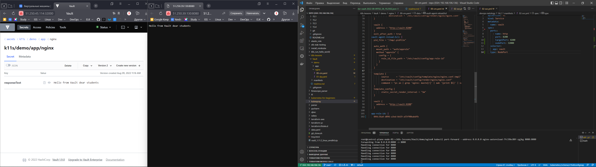

# Домашнее задание к занятию "14.2 Синхронизация секретов с внешними сервисами. Vault"

## Решение

## Задание 1

Запустить модуль Vault конфигураций через утилиту kubectl в установленном minikube

```console
root@control-plane-node-01:~/devops-netology/14.2# kubectl apply -f vault-pod.yml 
pod/14.2-netology-vault created
```

Получить значение внутреннего IP пода

```console
root@control-plane-node-01:~/devops-netology/14.2# kubectl get pod 14.2-netology-vault -o json | jq -c '.status.podIPs'
[{"ip":"10.233.78.7"}]
```

Примечание: jq - утилита для работы с JSON в командной строке

Запустить второй модуль для использования в качестве клиента

```
root@control-plane-node-01:~/devops-netology/14.2# kubectl run -i --tty fedora --image=fedora --restart=Never -- sh
If you don't see a command prompt, try pressing enter.
```

Установить дополнительные пакеты

```
dnf -y install pip
pip install hvac
```

<details>
  <summary>CUT</summary>

```console
sh-5.1# dnf -y install pip
Fedora 36 - x86_64                                                                                                                                        1.6 MB/s |  81 MB     00:49    
Fedora 36 openh264 (From Cisco) - x86_64                                                                                                                  1.7 kB/s | 2.5 kB     00:01    
Fedora Modular 36 - x86_64                                                                                                                                1.9 MB/s | 2.4 MB     00:01    
Fedora 36 - x86_64 - Updates                                                                                                                              793 kB/s |  24 MB     00:31    
Fedora Modular 36 - x86_64 - Updates                                                                                                                      780 kB/s | 2.4 MB     00:03    
Last metadata expiration check: 0:00:01 ago on Thu Aug  4 07:29:31 2022.
Dependencies resolved.
==========================================================================================================================================================================================
 Package                                             Architecture                            Version                                        Repository                               Size
==========================================================================================================================================================================================
Installing:
 python3-pip                                         noarch                                  21.3.1-2.fc36                                  fedora                                  1.8 M
Installing weak dependencies:
 libxcrypt-compat                                    x86_64                                  4.4.28-1.fc36                                  fedora                                   90 k
 python3-setuptools                                  noarch                                  59.6.0-2.fc36                                  fedora                                  936 k

Transaction Summary
==========================================================================================================================================================================================
Install  3 Packages

Total download size: 2.8 M
Installed size: 14 M
Downloading Packages:
(1/3): libxcrypt-compat-4.4.28-1.fc36.x86_64.rpm                                                                                                          361 kB/s |  90 kB     00:00    
(2/3): python3-setuptools-59.6.0-2.fc36.noarch.rpm                                                                                                        2.2 MB/s | 936 kB     00:00    
(3/3): python3-pip-21.3.1-2.fc36.noarch.rpm                                                                                                               3.8 MB/s | 1.8 MB     00:00    
------------------------------------------------------------------------------------------------------------------------------------------------------------------------------------------
Total                                                                                                                                                     2.1 MB/s | 2.8 MB     00:01     
Running transaction check
Transaction check succeeded.
Running transaction test
Transaction test succeeded.
Running transaction
  Preparing        :                                                                                                                                                                  1/1 
  Installing       : python3-setuptools-59.6.0-2.fc36.noarch                                                                                                                          1/3 
  Installing       : libxcrypt-compat-4.4.28-1.fc36.x86_64                                                                                                                            2/3 
  Installing       : python3-pip-21.3.1-2.fc36.noarch                                                                                                                                 3/3 
  Running scriptlet: python3-pip-21.3.1-2.fc36.noarch                                                                                                                                 3/3 
  Verifying        : libxcrypt-compat-4.4.28-1.fc36.x86_64                                                                                                                            1/3 
  Verifying        : python3-pip-21.3.1-2.fc36.noarch                                                                                                                                 2/3 
  Verifying        : python3-setuptools-59.6.0-2.fc36.noarch                                                                                                                          3/3 

Installed:
  libxcrypt-compat-4.4.28-1.fc36.x86_64                         python3-pip-21.3.1-2.fc36.noarch                         python3-setuptools-59.6.0-2.fc36.noarch                        

Complete!
sh-5.1# pip install hvac
Collecting hvac
  Downloading hvac-0.11.2-py2.py3-none-any.whl (148 kB)
     |████████████████████████████████| 148 kB 1.1 MB/s            
Collecting requests>=2.21.0
  Downloading requests-2.28.1-py3-none-any.whl (62 kB)
     |████████████████████████████████| 62 kB 428 kB/s             
Collecting six>=1.5.0
  Downloading six-1.16.0-py2.py3-none-any.whl (11 kB)
Collecting charset-normalizer<3,>=2
  Downloading charset_normalizer-2.1.0-py3-none-any.whl (39 kB)
Collecting certifi>=2017.4.17
  Downloading certifi-2022.6.15-py3-none-any.whl (160 kB)
     |████████████████████████████████| 160 kB 8.0 MB/s            
Collecting idna<4,>=2.5
  Downloading idna-3.3-py3-none-any.whl (61 kB)
     |████████████████████████████████| 61 kB 6.3 MB/s             
Collecting urllib3<1.27,>=1.21.1
  Downloading urllib3-1.26.11-py2.py3-none-any.whl (139 kB)
     |████████████████████████████████| 139 kB 24.6 MB/s            
Installing collected packages: urllib3, idna, charset-normalizer, certifi, six, requests, hvac
Successfully installed certifi-2022.6.15 charset-normalizer-2.1.0 hvac-0.11.2 idna-3.3 requests-2.28.1 six-1.16.0 urllib3-1.26.11
WARNING: Running pip as the 'root' user can result in broken permissions and conflicting behaviour with the system package manager. It is recommended to use a virtual environment instead: https://pip.pypa.io/warnings/venv
```

</details>
<br>

Запустить интепретатор Python и выполнить следующий код, предварительно
поменяв IP и токен


```Py
Python 3.10.4 (main, Mar 25 2022, 00:00:00) [GCC 12.0.1 20220308 (Red Hat 12.0.1-0)] on linux
Type "help", "copyright", "credits" or "license" for more information.
>>> import hvac
>>> client = hvac.Client(
...     url='http://10.233.78.7:8200',
...     token='aiphohTaa0eeHei'
... )
>>> client.is_authenticated()
True
>>> # Пишем секрет
>>> client.secrets.kv.v2.create_or_update_secret(
...     path='hvac',
...     secret=dict(netology='Big secret!!!'),
... )
{'request_id': '5217321b-9498-bfa2-6629-7ec390ebcff4', 'lease_id': '', 'renewable': False, 'lease_duration': 0, 'data': {'created_time': '2022-08-04T07:38:08.999986874Z', 'custom_metadata': None, 'deletion_time': '', 'destroyed': False, 'version': 2}, 'wrap_info': None, 'warnings': None, 'auth': None}
>>> # Читаем секрет
>>> client.secrets.kv.v2.read_secret_version(
...     path='hvac',
... )
{'request_id': 'c200b949-ae0f-a411-e9fa-1be922cb26b1', 'lease_id': '', 'renewable': False, 'lease_duration': 0, 'data': {'data': {'netology': 'Big secret!!!'}, 'metadata': {'created_time': '2022-08-04T07:38:08.999986874Z', 'custom_metadata': None, 'deletion_time': '', 'destroyed': False, 'version': 2}}, 'wrap_info': None, 'warnings': None, 'auth': None}
>>> # Читаем секрет
>>> print(client.secrets.kv.v2.read_secret_version(
...     path='hvac',
... )['data']['data'])
{'netology': 'Big secret!!!'}
```

## Задание 2

Повторил запуск nginx с использованием секретов из vault, но второе демо-приложение запустить не удается.




## Задача 1: Работа с модулем Vault

Запустить модуль Vault конфигураций через утилиту kubectl в установленном minikube

```
kubectl apply -f 14.2/vault-pod.yml
```

Получить значение внутреннего IP пода

```
kubectl get pod 14.2-netology-vault -o json | jq -c '.status.podIPs'
```

Примечание: jq - утилита для работы с JSON в командной строке

Запустить второй модуль для использования в качестве клиента

```
kubectl run -i --tty fedora --image=fedora --restart=Never -- sh
```

Установить дополнительные пакеты

```
dnf -y install pip
pip install hvac
```

Запустить интепретатор Python и выполнить следующий код, предварительно
поменяв IP и токен

```
import hvac
client = hvac.Client(
    url='http://10.10.133.71:8200',
    token='aiphohTaa0eeHei'
)
client.is_authenticated()

# Пишем секрет
client.secrets.kv.v2.create_or_update_secret(
    path='hvac',
    secret=dict(netology='Big secret!!!'),
)

# Читаем секрет
client.secrets.kv.v2.read_secret_version(
    path='hvac',
)
```

## Задача 2 (*): Работа с секретами внутри модуля

* На основе образа fedora создать модуль;
* Создать секрет, в котором будет указан токен;
* Подключить секрет к модулю;
* Запустить модуль и проверить доступность сервиса Vault.

---

### Как оформить ДЗ?

Выполненное домашнее задание пришлите ссылкой на .md-файл в вашем репозитории.

В качестве решения прикрепите к ДЗ конфиг файлы для деплоя. Прикрепите скриншоты вывода команды kubectl со списком запущенных объектов каждого типа (pods, deployments, statefulset, service) или скриншот из самого Kubernetes, что сервисы подняты и работают, а также вывод из CLI.

---

## Использованные материалы:

https://gitlab.com/k11s-os/k8s-lessons

## Ошибки

```console
root@control-plane-node-01:~/k8s-lessons/Vault/manifests# kubectl get pod
NAME                                                 READY   STATUS              RESTARTS   AGE
nfs-client-provisioner-1659948102-57c9cb8b69-gm4tw   0/1     ContainerCreating   0          159m
nfs-server-nfs-server-provisioner-0                  1/1     Running             0          3h4m
vault-0                                              0/1     ContainerCreating   0          157m
root@control-plane-node-01:~/k8s-lessons/Vault/manifests# kubectl describe pod nfs-client-provisioner-1659948102-57c9cb8b69-gm4tw 
Events:
  Type     Reason       Age                    From     Message
  ----     ------       ----                   ----     -------
  Warning  FailedMount  48m (x11 over 141m)    kubelet  Unable to attach or mount volumes: unmounted volumes=[nfs-client-root], unattached volumes=[kube-api-access-zmh9s nfs-client-root]: timed out waiting for the condition
  Warning  FailedMount  8m40s (x82 over 159m)  kubelet  MountVolume.SetUp failed for volume "nfs-client-root" : mount failed: exit status 32
Mounting command: mount
Mounting arguments: -t nfs 10.130.0.20:/exported/path /var/lib/kubelet/pods/b8f56731-986c-4539-816e-460f5e437250/volumes/kubernetes.io~nfs/nfs-client-root
Output: mount: /var/lib/kubelet/pods/b8f56731-986c-4539-816e-460f5e437250/volumes/kubernetes.io~nfs/nfs-client-root: bad option; for several filesystems (e.g. nfs, cifs) you might need a /sbin/mount.<type> helper program.
  Warning  FailedMount  2m54s (x54 over 157m)  kubelet  Unable to attach or mount volumes: unmounted volumes=[nfs-client-root], unattached volumes=[nfs-client-root kube-api-access-zmh9s]: timed out waiting for the condition
root@control-plane-node-01:~/k8s-lessons/Vault/manifests# kubectl describe pod vault-0 
\Events:
  Type     Reason       Age                    From     Message
  ----     ------       ----                   ----     -------
  Warning  FailedMount  47m (x17 over 146m)    kubelet  Unable to attach or mount volumes: unmounted volumes=[vault-data], unattached volumes=[vault-data kube-api-access-hjgmk config]: timed out waiting for the condition
  Warning  FailedMount  13m (x36 over 156m)    kubelet  Unable to attach or mount volumes: unmounted volumes=[vault-data], unattached volumes=[config vault-data kube-api-access-hjgmk]: timed out waiting for the condition
  Warning  FailedMount  7m30s (x82 over 158m)  kubelet  MountVolume.SetUp failed for volume "pvc-fb1dc2cc-1101-4307-9c4a-1410b4e7e861" : mount failed: exit status 32
Mounting command: mount
Mounting arguments: -t nfs -o vers=3 10.233.13.202:/export/pvc-fb1dc2cc-1101-4307-9c4a-1410b4e7e861 /var/lib/kubelet/pods/234fbe56-d450-4906-acf5-72cb37c8f793/volumes/kubernetes.io~nfs/pvc-fb1dc2cc-1101-4307-9c4a-1410b4e7e861
Output: mount: /var/lib/kubelet/pods/234fbe56-d450-4906-acf5-72cb37c8f793/volumes/kubernetes.io~nfs/pvc-fb1dc2cc-1101-4307-9c4a-1410b4e7e861: bad option; for several filesystems (e.g. nfs, cifs) you might need a /sbin/mount.<type> helper program.
  Warning  FailedMount  104s (x11 over 153m)  kubelet  Unable to attach or mount volumes: unmounted volumes=[vault-data], unattached volumes=[kube-api-access-hjgmk config vault-data]: timed out waiting for the condition

```
Решение проблемы:

```
установка на worker ноды apt-get install -y nfs-common
```