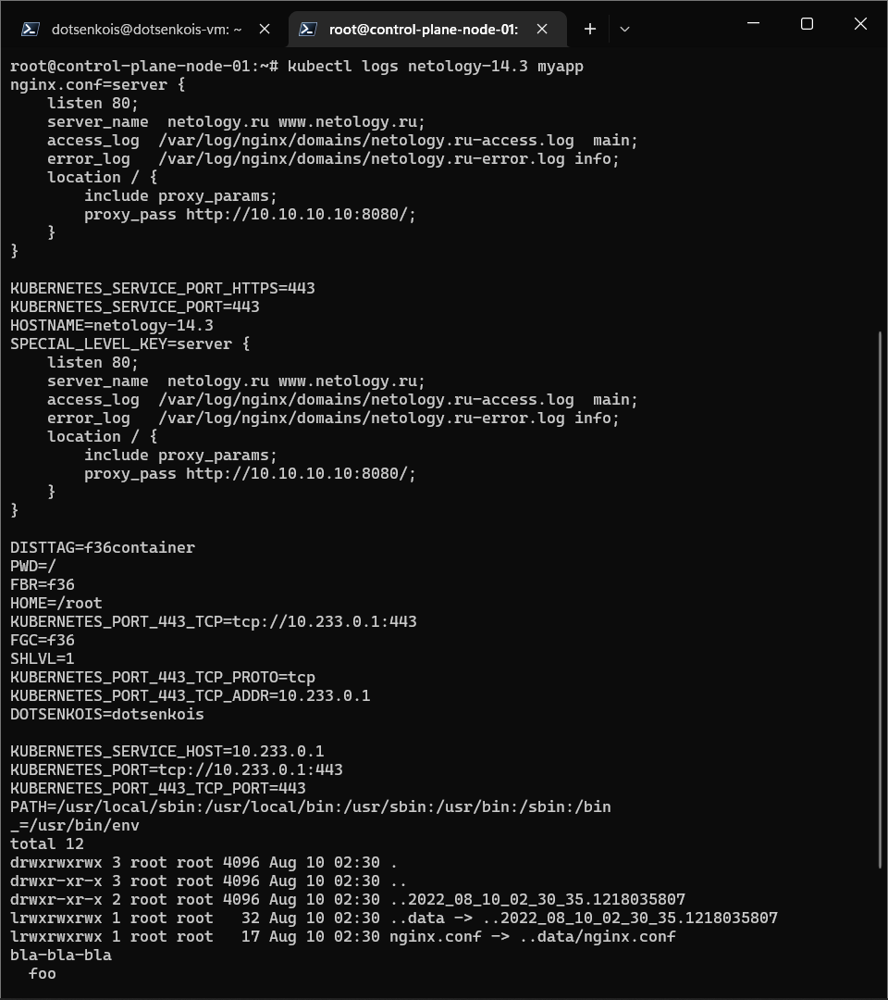

# Домашнее задание к занятию "14.3 Карты конфигураций"

## Решение

## Задание 1

Выполните приведённые команды в консоли. Получите вывод команд. Сохраните
задачу 1 как справочный материал.

### Как создать карту конфигураций?

```console
root@control-plane-node-01:~/devops-netology/14.3# kubectl create configmap nginx-config --from-file=nginx.conf
configmap/nginx-config created
root@control-plane-node-01:~/devops-netology/14.3# kubectl create configmap domain --from-literal=name=netology.ru
configmap/domain created
```

### Как просмотреть список карт конфигураций?

```console
root@control-plane-node-01:~/devops-netology/14.3# kubectl get configmaps
NAME               DATA   AGE
domain             1      75s
kube-root-ca.crt   1      4m56s
nginx-config       1      87s
root@control-plane-node-01:~/devops-netology/14.3# kubectl get configmap
NAME               DATA   AGE
domain             1      80s
kube-root-ca.crt   1      5m1s
nginx-config       1      92s
```

### Как просмотреть карту конфигурации?

```console
root@control-plane-node-01:~/devops-netology/14.3# kubectl get configmap nginx-config
NAME           DATA   AGE
nginx-config   1      106s
root@control-plane-node-01:~/devops-netology/14.3# kubectl describe configmap domain
Name:         domain
Namespace:    14-3
Labels:       <none>
Annotations:  <none>

Data
====
name:
----
netology.ru

BinaryData
====

Events:  <none>
```

### Как получить информацию в формате YAML и/или JSON?

```console
root@control-plane-node-01:~/devops-netology/14.3# kubectl get configmap nginx-config -o yaml
apiVersion: v1
data:
  nginx.conf: |
    server {
        listen 80;
        server_name  netology.ru www.netology.ru;
        access_log  /var/log/nginx/domains/netology.ru-access.log  main;
        error_log   /var/log/nginx/domains/netology.ru-error.log info;
        location / {
            include proxy_params;
            proxy_pass http://10.10.10.10:8080/;
        }
    }
kind: ConfigMap
metadata:
  creationTimestamp: "2022-08-10T01:27:18Z"
  name: nginx-config
  namespace: 14-3
  resourceVersion: "296467"
  uid: 092fd3fe-0a92-48ce-9d25-31684ec90299
root@control-plane-node-01:~/devops-netology/14.3# kubectl get configmap domain -o json
{
    "apiVersion": "v1",
    "data": {
        "name": "netology.ru"
    },
    "kind": "ConfigMap",
    "metadata": {
        "creationTimestamp": "2022-08-10T01:27:30Z",
        "name": "domain",
        "namespace": "14-3",
        "resourceVersion": "296493",
        "uid": "074429f4-e00c-4a9e-82b3-32c56989b32a"
    }
}
```

### Как выгрузить карту конфигурации и сохранить его в файл?

```console
kubectl get configmaps -o json > configmaps.json
kubectl get configmap nginx-config -o yaml > nginx-config.yml
```

[configmaps.json](./configmaps.json)

[nginx-config.yml](./nginx-config.yml)


### Как удалить карту конфигурации?

```console
root@control-plane-node-01:~/devops-netology/14.3# kubectl delete configmap nginx-config
configmap "nginx-config" deleted
```

### Как загрузить карту конфигурации из файла?

```console
root@control-plane-node-01:~/devops-netology/14.3# kubectl apply -f nginx-config.yml
configmap/nginx-config created
```

## Задание 2

- За оснву взят конфиг пода [myapp-pod.yml](./myapp-pod.yml)
- Добавилены секции:

```yaml
      - name: DOTSENKOIS
        valueFrom:
          configMapKeyRef:
            name: dotsenkois
            key: variable
```
```yaml
    volumeMounts:
      - name: config
        mountPath: /etc/nginx/conf.d
        readOnly: true
      - name: test
        mountPath: /tmp
        readOnly: true
  volumes:
  - name: config
    configMap:
      name: nginx-config
  - name: test
    configMap:
      name: test

```

- Созданы карты конфигурации [dotsenkois.yml](./dotsenkois.yml) и [test.yml](./test.yml)


```console
root@control-plane-node-01:~/devops-netology/14.3# kubectl describe configmaps dotsenkois 
Name:         dotsenkois
Namespace:    14-3
Labels:       <none>
Annotations:  <none>

Data
====
variable:
----
dotsenkois


BinaryData
====

Events:  <none>
root@control-plane-node-01:~/devops-netology/14.3# kubectl describe configmaps test 
Name:         test
Namespace:    14-3
Labels:       <none>
Annotations:  <none>

Data
====
test:
----
bla-bla-bla
  foo


BinaryData
====

Events:  <none>
```

- вывод логов приложения:
```
    command: ['/bin/bash', '-c']
    args: ["env; ls -la /etc/nginx/conf.d; cat /tmp/test"]

```



## Задания

## Задача 1: Работа с картами конфигураций через утилиту kubectl в установленном minikube

Выполните приведённые команды в консоли. Получите вывод команд. Сохраните
задачу 1 как справочный материал.

### Как создать карту конфигураций?

```
kubectl create configmap nginx-config --from-file=nginx.conf
kubectl create configmap domain --from-literal=name=netology.ru
```

### Как просмотреть список карт конфигураций?

```
kubectl get configmaps
kubectl get configmap
```

### Как просмотреть карту конфигурации?

```
kubectl get configmap nginx-config
kubectl describe configmap domain
```

### Как получить информацию в формате YAML и/или JSON?

```
kubectl get configmap nginx-config -o yaml
kubectl get configmap domain -o json
```

### Как выгрузить карту конфигурации и сохранить его в файл?

```
kubectl get configmaps -o json > configmaps.json
kubectl get configmap nginx-config -o yaml > nginx-config.yml
```

### Как удалить карту конфигурации?

```
kubectl delete configmap nginx-config
```

### Как загрузить карту конфигурации из файла?

```
kubectl apply -f nginx-config.yml
```

## Задача 2 (*): Работа с картами конфигураций внутри модуля

Выбрать любимый образ контейнера, подключить карты конфигураций и проверить
их доступность как в виде переменных окружения, так и в виде примонтированного
тома

---

### Как оформить ДЗ?

Выполненное домашнее задание пришлите ссылкой на .md-файл в вашем репозитории.

В качестве решения прикрепите к ДЗ конфиг файлы для деплоя. Прикрепите скриншоты вывода команды kubectl со списком запущенных объектов каждого типа (pods, deployments, configmaps) или скриншот из самого Kubernetes, что сервисы подняты и работают, а также вывод из CLI.

---
