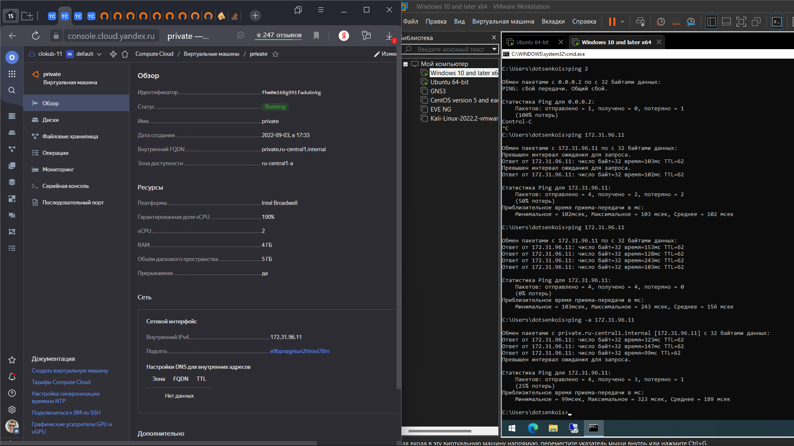

# Домашнее задание к занятию "15.1. Организация сети"

## Решение

Конфигурация инфраструктуры выполнена с помощью [terraform](./yc-tf/main.tf).

[проверка точки выхода в интернет](https://cloud.yandex.ru/docs/tutorials/routing/nat-instance)

curl ifconfig.co

openVPN сервер настроен руками: добавлена группа "auto-login", создан пользователь, скачан файл конфигурации и ипортирован в openVPN клиент установленный в  виртуальной машине, работающей на локальном компьютере.

# main
## Задание

Настроить Production like сеть в рамках одной зоны с помощью terraform. Модуль VPC умеет автоматически делать все что есть в этом задании. Но мы воспользуемся более низкоуровневыми абстракциями, чтобы понять, как оно устроено внутри.

1. Создать VPC.

- Используя vpc-модуль terraform, создать пустую VPC с подсетью 172.31.0.0/16.
- Выбрать регион и зону.

2. Публичная сеть.

- Создать в vpc subnet с названием public, сетью 172.31.32.0/19 и Internet gateway.
- Добавить RouteTable, направляющий весь исходящий трафик в Internet gateway.
- Создать в этой приватной сети виртуалку с публичным IP и подключиться к ней, убедиться что есть доступ к интернету.

3. Приватная сеть.

- Создать в vpc subnet с названием private, сетью 172.31.96.0/19.
- Добавить NAT gateway в public subnet.
- Добавить Route, направляющий весь исходящий трафик private сети в NAT.

4. VPN.

- Настроить VPN, соединить его с сетью private.
- Создать себе учетную запись и подключиться через нее.
- Создать виртуалку в приватной сети.
- Подключиться к ней по SSH по приватному IP и убедиться, что с виртуалки есть выход в интернет.

Документация по AWS-ресурсам:

- [Getting started with Client VPN](https://docs.aws.amazon.com/vpn/latest/clientvpn-admin/cvpn-getting-started.html)

Модули terraform

- [VPC](https://registry.terraform.io/providers/hashicorp/aws/latest/docs/resources/vpc)
- [Subnet](https://registry.terraform.io/providers/hashicorp/aws/latest/docs/resources/subnet)
- [Internet Gateway](https://registry.terraform.io/providers/hashicorp/aws/latest/docs/resources/internet_gateway)

# clocub-5
# Домашнее задание к занятию "15.1. Организация сети"

Домашнее задание будет состоять из обязательной части, которую необходимо выполнить на провайдере Яндекс.Облако и дополнительной части в AWS по желанию. Все домашние задания в 15 блоке связаны друг с другом и в конце представляют пример законченной инфраструктуры.  
Все задания требуется выполнить с помощью Terraform, результатом выполненного домашнего задания будет код в репозитории. 

Перед началом работ следует настроить доступ до облачных ресурсов из Terraform используя материалы прошлых лекций и [ДЗ](https://github.com/netology-code/virt-homeworks/tree/master/07-terraform-02-syntax ). А также заранее выбрать регион (в случае AWS) и зону.

---
## Задание 1. Яндекс.Облако (обязательное к выполнению)

1. Создать VPC.
- Создать пустую VPC. Выбрать зону.
2. Публичная подсеть.
- Создать в vpc subnet с названием public, сетью 192.168.10.0/24.
- Создать в этой подсети NAT-инстанс, присвоив ему адрес 192.168.10.254. В качестве image_id использовать fd80mrhj8fl2oe87o4e1
- Создать в этой публичной подсети виртуалку с публичным IP и подключиться к ней, убедиться что есть доступ к интернету.
3. Приватная подсеть.
- Создать в vpc subnet с названием private, сетью 192.168.20.0/24.
- Создать route table. Добавить статический маршрут, направляющий весь исходящий трафик private сети в NAT-инстанс
- Создать в этой приватной подсети виртуалку с внутренним IP, подключиться к ней через виртуалку, созданную ранее и убедиться что есть доступ к интернету

Resource terraform для ЯО
- [VPC subnet](https://registry.terraform.io/providers/yandex-cloud/yandex/latest/docs/resources/vpc_subnet)
- [Route table](https://registry.terraform.io/providers/yandex-cloud/yandex/latest/docs/resources/vpc_route_table)
- [Compute Instance](https://registry.terraform.io/providers/yandex-cloud/yandex/latest/docs/resources/compute_instance)
---
## Задание 2*. AWS (необязательное к выполнению)

1. Создать VPC.
- Cоздать пустую VPC с подсетью 10.10.0.0/16.
2. Публичная подсеть.
- Создать в vpc subnet с названием public, сетью 10.10.1.0/24
- Разрешить в данной subnet присвоение public IP по-умолчанию. 
- Создать Internet gateway 
- Добавить в таблицу маршрутизации маршрут, направляющий весь исходящий трафик в Internet gateway.
- Создать security group с разрешающими правилами на SSH и ICMP. Привязать данную security-group на все создаваемые в данном ДЗ виртуалки
- Создать в этой подсети виртуалку и убедиться, что инстанс имеет публичный IP. Подключиться к ней, убедиться что есть доступ к интернету.
- Добавить NAT gateway в public subnet.
3. Приватная подсеть.
- Создать в vpc subnet с названием private, сетью 10.10.2.0/24
- Создать отдельную таблицу маршрутизации и привязать ее к private-подсети
- Добавить Route, направляющий весь исходящий трафик private сети в NAT.
- Создать виртуалку в приватной сети.
- Подключиться к ней по SSH по приватному IP через виртуалку, созданную ранее в публичной подсети и убедиться, что с виртуалки есть выход в интернет.

Resource terraform
- [VPC](https://registry.terraform.io/providers/hashicorp/aws/latest/docs/resources/vpc)
- [Subnet](https://registry.terraform.io/providers/hashicorp/aws/latest/docs/resources/subnet)
- [Internet Gateway](https://registry.terraform.io/providers/hashicorp/aws/latest/docs/resources/internet_gateway)
