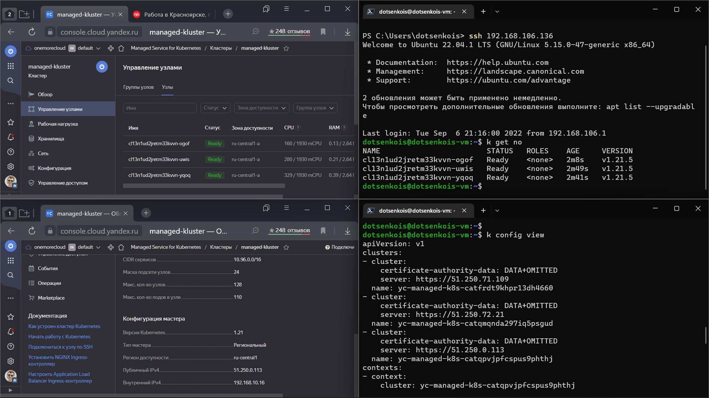

# Домашнее задание к занятию 15.4 "Кластеры. Ресурсы под управлением облачных провайдеров"

## Решение

## 1

- [Используя настройки VPC с предыдущих ДЗ, добавить дополнительно подсеть private в разных зонах, чтобы обеспечить отказоустойчивость](./yc-tf/01.network.tf)
- [Разместить ноды кластера MySQL в разных подсетях](./yc-tf/01.MySQL.tf)
- [Необходимо предусмотреть репликацию с произвольным временем технического обслуживания](./yc-tf/01.MySQL.tf)
- [Использовать окружение PRESTABLE, платформу Intel Broadwell с производительностью 50% CPU и размером диска 20](./yc-tf/01.MySQL.tf)
- [Задать время начала резервного копирования - 23:59](./yc-tf/01.MySQL.tf)
- [Включить защиту кластера от непреднамеренного удаления](./yc-tf/01.MySQL.tf)
- [Создать БД с именем `netology_db` c логином и паролем](./yc-tf/01.MySQL.tf)

## 2.

- [Используя настройки VPC с предыдущих ДЗ, добавить дополнительно 2 подсети public в разных зонах, чтобы обеспечить отказоустойчивость](./yc-tf/02.k8s_network.tf)
- [Создать отдельный сервис-аккаунт с необходимыми правами](./yc-tf/02.k8s-sa.tf)
- [Создать региональный мастер kubernetes с размещением нод в разных 3 подсетях](./yc-tf/02.k8s-cluster.tf)

    **allocation_policy.locations: auto scale node groups can have only one location**

- [Добавить возможность шифрования ключом из KMS, созданного в предыдущем ДЗ](./yc-tf/02.kms.tf)
- [Создать группу узлов состояющую из 3 машин с автомасштабированием до 6](./yc-tf/02.k8s-ng.tf)
- [Подключиться к кластеру с помощью `kubectl`](./yc-tf/02.kubeconfig.tf)

- *Запустить микросервис phpmyadmin и подключиться к БД, созданной ранее
- *Создать сервис типа Load Balancer и подключиться к phpmyadmin. Предоставить скриншот с публичным адресом и подключением к БД

## Задание

Организация кластера Kubernetes и кластера баз данных MySQL в отказоустойчивой архитектуре.
Размещение в private подсетях кластера БД, а в public - кластера Kubernetes.

---
## Задание 1. Яндекс.Облако (обязательное к выполнению)

1. Настроить с помощью Terraform кластер баз данных MySQL:
- Используя настройки VPC с предыдущих ДЗ, добавить дополнительно подсеть private в разных зонах, чтобы обеспечить отказоустойчивость 
- Разместить ноды кластера MySQL в разных подсетях
- Необходимо предусмотреть репликацию с произвольным временем технического обслуживания
- Использовать окружение PRESTABLE, платформу Intel Broadwell с производительностью 50% CPU и размером диска 20 Гб
- Задать время начала резервного копирования - 23:59
- Включить защиту кластера от непреднамеренного удаления
- Создать БД с именем `netology_db` c логином и паролем

2. Настроить с помощью Terraform кластер Kubernetes

- Используя настройки VPC с предыдущих ДЗ, добавить дополнительно 2 подсети public в разных зонах, чтобы обеспечить отказоустойчивость
- Создать отдельный сервис-аккаунт с необходимыми правами 
- Создать региональный мастер kubernetes с размещением нод в разных 3 подсетях
- Добавить возможность шифрования ключом из KMS, созданного в предыдущем ДЗ
- Создать группу узлов состояющую из 3 машин с автомасштабированием до 6
- Подключиться к кластеру с помощью `kubectl`
- *Запустить микросервис phpmyadmin и подключиться к БД, созданной ранее
- *Создать сервис типы Load Balancer и подключиться к phpmyadmin. Предоставить скриншот с публичным адресом и подключением к БД

Документация
- [MySQL cluster](https://registry.terraform.io/providers/yandex-cloud/yandex/latest/docs/resources/mdb_mysql_cluster)
- [Создание кластера kubernetes](https://cloud.yandex.ru/docs/managed-kubernetes/operations/kubernetes-cluster/kubernetes-cluster-create)
- [K8S Cluster](https://registry.terraform.io/providers/yandex-cloud/yandex/latest/docs/resources/kubernetes_cluster)
- [K8S node group](https://registry.terraform.io/providers/yandex-cloud/yandex/latest/docs/resources/kubernetes_node_group)
--- 
## Задание 2. Вариант с AWS (необязательное к выполнению)

1. Настроить с помощью terraform кластер EKS в 3 AZ региона, а также RDS на базе MySQL с поддержкой MultiAZ для репликации и создать 2 readreplica для работы:
- Создать кластер RDS на базе MySQL
- Разместить в Private subnet и обеспечить доступ из public-сети c помощью security-group
- Настроить backup в 7 дней и MultiAZ для обеспечения отказоустойчивости
- Настроить Read prelica в кол-ве 2 шт на 2 AZ.

2. Создать кластер EKS на базе EC2:
- С помощью terraform установить кластер EKS на 3 EC2-инстансах в VPC в public-сети
- Обеспечить доступ до БД RDS в private-сети
- С помощью kubectl установить и запустить контейнер с phpmyadmin (образ взять из docker hub) и проверить подключение к БД RDS
- Подключить ELB (на выбор) к приложению, предоставить скрин

Документация
- [Модуль EKS](https://learn.hashicorp.com/tutorials/terraform/eks)
